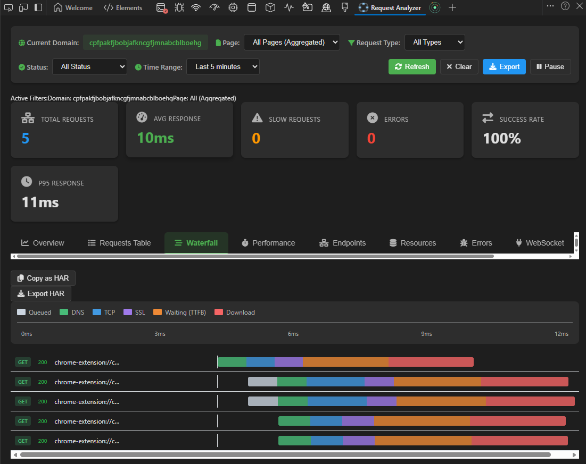
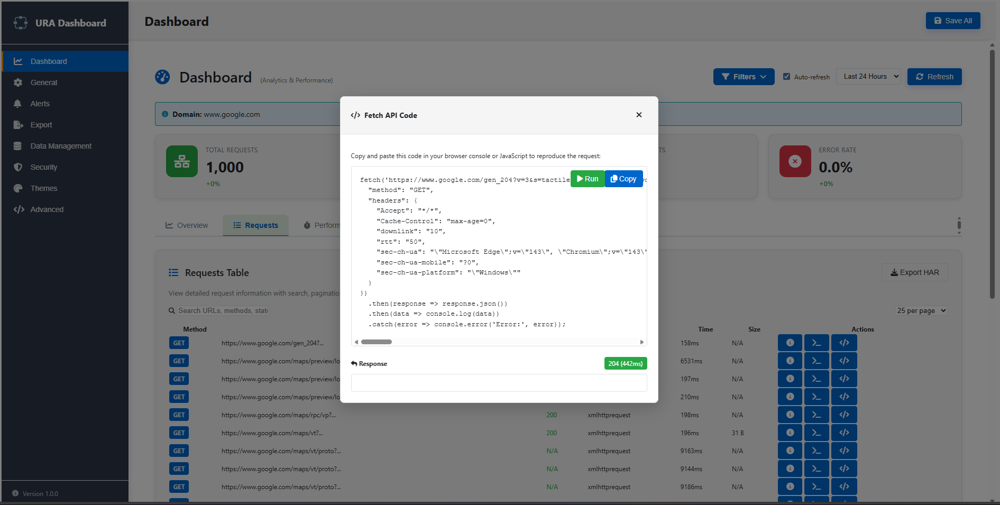
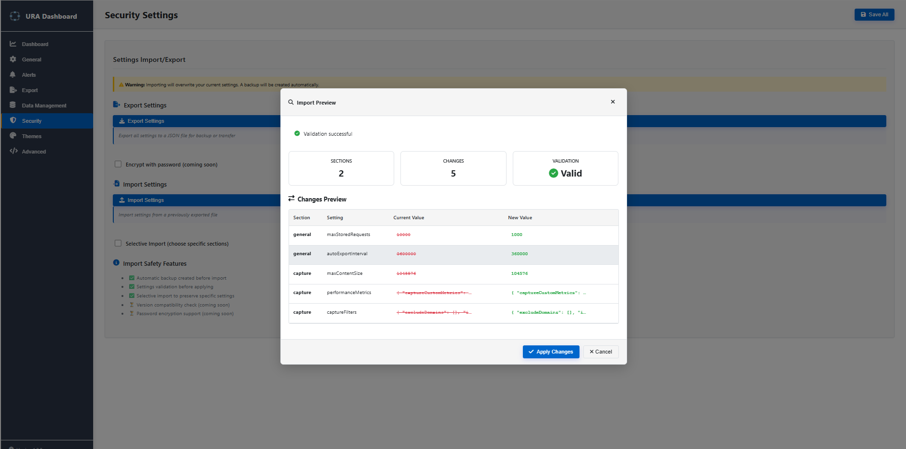
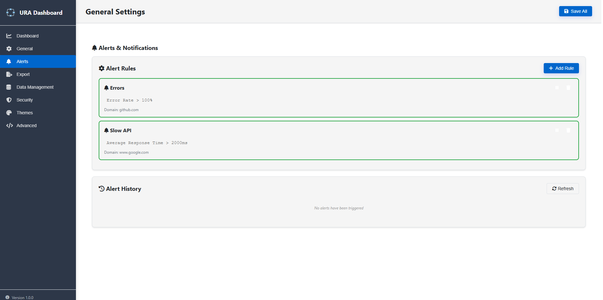

# Universal Request Analyzer

> **DevTools-like network inspection with history, analytics, and performance tracking**

[](https://ModernaCyber.github.io/Universal-Request-Analyzer/)
[](LICENSE)
[](https://chrome.google.com/webstore)
[](https://addons.mozilla.org)

Never lose your network debugging data again. Universal Request Analyzer captures every network request and lets you analyze it anytime — like Chrome DevTools, but with data persistence, historical analysis, and powerful analytics.

**🌐 [View Full Documentation & Screenshots](https://ModernaCyber.github.io/Universal-Request-Analyzer/)**

## Screenshots

### DevTools Panel

*Real-time network monitoring with advanced filtering*


*Performance waterfall visualization*

### Dashboard & Analytics

*Comprehensive performance analytics and trends*


*Detailed request inspection with timing breakdown*

### Request Actions

*Copy as Fetch API code with Run button to execute requests*


*Export requests as cURL commands*

### Data Management

*Complete data management dashboard with cleanup and retention controls*


*Direct SQL query interface for advanced users*


*Flexible data export options*


*Import/export configuration settings*

### Error Tracking & Monitoring

*Track and analyze failed requests*


*Real-time alert notifications*

### Customization

*Light/Dark theme support with CSS variables*

## Why Use Universal Request Analyzer?

**The Problem:** Chrome DevTools is great for real-time debugging, but your data disappears when you close the tab. You can't track performance over time, compare different sessions, or analyze historical patterns.

**The Solution:** Universal Request Analyzer gives you:
- 🕐 **Persistent Data** - Your request data survives tab/browser closes
- 📊 **Historical Analytics** - Track performance trends over days and weeks
- 🔍 **Advanced Search** - Find any request across all your browsing history
- 📈 **Performance Insights** - Identify slow APIs and third-party services
- 💾 **Export Anywhere** - HAR, JSON, CSV formats for sharing and analysis

### Perfect For:
- 🐛 Debugging intermittent API issues that are hard to reproduce
- ⚡ Performance optimization and regression detection
- 🔍 Analyzing third-party service impact on your site
- 📋 Sharing network evidence for bug reports
- 📊 Tracking API performance over time

## Features

- **Unified Filtering System**: Hierarchical filtering by domain → page → request type across all interfaces
- **Time Travel**: View historical performance data and trends over time
- **Real-time Analytics**: Capture and analyze network requests in real-time
- **Detailed Performance Metrics**: Track DNS, TCP, SSL, TTFB, and download times
- **Rich Visualizations**: Interactive charts and graphs for request data
- **Cross-browser Compatibility**: Works on Chrome, Firefox, and Edge
- **Export Capabilities**: Export filtered data for further analysis
- **Configurable Monitoring**: Flexible filter options and retention settings

## Unified Filtering

The extension provides consistent filtering across three interfaces:

### Popup
- **Auto-filtered by current domain**: Automatically shows metrics for the current tab's domain
- **Request type filter**: Filter by XHR/API, Fetch, Scripts, Stylesheets, Images, Fonts, Documents
- **Aggregated metrics**: Shows combined statistics across all pages within the domain
- **Quick insights**: View total requests, average response time, errors, and data transferred

### DevTools Panel
- **Domain filter**: Select current domain, all domains, or specific tracked domains
- **Page filter**: Choose specific pages or view aggregated data for the domain
- **Request type filter**: Filter by resource type
- **Time range selection**: View data from last 5 minutes to last 30 days
- **Time Travel**: Access historical data with hourly, daily, or minute-by-minute grouping
- **Multiple tabs**: Overview, Requests Table, Performance, Endpoints, and Errors
- **Real-time updates**: Auto-refresh every 5 seconds with instant filter application

### Dashboard
- **All domains**: View metrics across all tracked domains
- **Domain → Page hierarchy**: Select domain first, then choose specific pages
- **Request type filtering**: Filter by resource type
- **Time range selection**: Analyze data over different time periods
- **Comprehensive charts**: Volume timeline, status distribution, performance trends

## Time Travel Feature

Navigate through historical performance data:

1. Click the "History" button in the DevTools Panel
2. Select grouping: Hourly, Daily, or By Minute
3. View historical trends for:
   - Request volume over time
   - Average response times
   - Error rates and patterns
   - Performance regressions

## Performance Metrics

The extension captures detailed performance monitoring:

- DNS lookup time
- TCP connection time
- SSL/TLS handshake time
- Time to First Byte (TTFB)
- Download time
- Total request duration
- P95, P99 percentiles

*Note: Performance metrics are disabled by default to minimize performance impact. Enable them in extension settings when needed.*

### Performance Monitoring Configuration

- Enable/disable performance monitoring
- Adjust sampling rate (default: 100%)
- Configure metric retention period (default: 7 days)
- Choose specific metrics to capture:
  - Navigation Timing
  - Resource Timing
  - Server Timing
  - Custom Metrics

## Quick Start

### Installation

**From Browser Store:**
- **Chrome/Edge:** [Chrome Web Store](https://chrome.google.com/webstore) - Search for "Universal Request Analyzer"
- **Firefox:** [Firefox Add-ons](https://addons.mozilla.org) - Search for "Universal Request Analyzer"

**Manual Installation (Developers):**
1. Clone this repository
2. Run `npm install` and `npm run build`
3. Load the `dist` folder as an unpacked extension

### First Use (30 seconds)

1. **Install** the extension
2. **Browse** any website normally
3. **Click** the extension icon to see captured requests
4. **That's it!** Your data is automatically saved

No configuration needed. No complex setup. Just install and it works.

## Usage

### Popup Interface
1. Click the extension icon to open the popup
2. View current domain's aggregated metrics
3. Use the request type filter to focus on specific resource types
4. Click "Analytics" to open the DevTools Panel or "Dashboard" for full view

### DevTools Panel
1. Open Chrome DevTools (F12)
2. Navigate to the "Request Analyzer" tab
3. Use filters to narrow down requests:
   - **Domain**: Select which domain to analyze
   - **Page**: Choose specific page or view all pages aggregated
   - **Time Range**: Select how far back to look (5 min to 30 days)
   - **Request Type**: Filter by resource type
   - **Status**: Filter by HTTP status codes
4. Switch between tabs for different views:
   - **Overview**: Real-time charts and key metrics
   - **Requests Table**: Detailed request information with sorting
   - **Performance**: Timing breakdowns and slow request analysis
   - **Endpoints**: API endpoint performance analysis
   - **Errors**: Failed requests categorization
5. Click "History" to access time-travel feature

### Dashboard
1. Open the extension options/settings page
2. Navigate to the Dashboard tab
3. Select domain and optionally a specific page
4. Choose time range and request type filters
5. View comprehensive performance analytics

## Filter Hierarchy

```
Popup:     [Auto: Current Domain] → [All Pages Aggregated] → [Request Type]
Panel:     [Domain] → [Page] → [Request Type] → [Status] → [Time Range]
Dashboard: [Domain] → [Page] → [Request Type] → [Time Range]
```

**Aggregation behavior:**
- When no specific page is selected: Shows aggregated metrics across all pages in the domain
- When a page is selected: Shows metrics only for that specific page

## More Than DevTools

| Feature | DevTools | Universal Request Analyzer |
|---------|----------|---------------------------|
| Request Inspection | ✅ | ✅ |
| Performance Timing | ✅ | ✅ Enhanced |
| Filtering & Search | ✅ | ✅ Advanced |
| **Data Persistence** | ❌ Lost on close | ✅ **Saved forever** |
| **Historical Analysis** | ❌ | ✅ **Days/weeks of data** |
| **Cross-Page Analytics** | ❌ | ✅ **All domains** |
| **Performance Trending** | ❌ | ✅ **Track over time** |
| **Third-Party Impact** | ❌ | ✅ **Auto-categorized** |
| **Export/Share** | HAR only | ✅ **Multiple formats** |

## Configuration

### Simple Setup (Recommended)

Just install and use! The extension works out of the box with smart defaults:
- ✅ Request capture enabled
- ✅ 7-day data retention
- ✅ Auto-refresh every 5 seconds
- ✅ Current domain filtering in popup

### Advanced Configuration (Optional)

Access via extension options for power users:
- **Performance Metrics**: Enable detailed timing breakdown (DNS, TCP, SSL, etc.)
- **Data Retention**: Adjust from 1 to 30 days
- **Sampling Rate**: Reduce overhead for high-traffic sites
- **Export Settings**: Configure default export format
- **Advanced Analytics**: Star schema, OHLC analysis, multi-timeframe trending

## Browser Compatibility

Fully compatible with:

- Google Chrome (v88+)
- Mozilla Firefox (v109+)
- Microsoft Edge (v88+)

## Documentation

- **[User Guide](docs/USER_GUIDE.md)** - Comprehensive guide for all features
- **[Development Guide](docs/DEVELOPMENT.md)** - Setup, building, testing, contributing
- **[Architecture](docs/ARCHITECTURE.md)** - Technical architecture and design
- **[Adoption Analysis](docs/ADOPTION_ANALYSIS.md)** - Market analysis and roadmap

## Development

**Quick Start:**
```bash
git clone https://github.com/ModernaCyber/Universal-Request-Analyzer.git
cd Universal-Request-Analyzer
npm install
npm run build
```

Then load the `dist` folder as an unpacked extension.

**Available Commands:**
- `npm run dev` - Development mode with watch
- `npm run build` - Production build
- `npm test` - Run tests
- `npm run lint` - Check code style

See [Development Guide](docs/DEVELOPMENT.md) for detailed instructions.

## Technical Highlights

For developers and performance engineers who want to dive deep:

### Advanced Analytics Architecture
- **Medallion Architecture**: Bronze (raw) → Silver (validated) → Gold (analytics) data layers
- **Star Schema**: Dimensional analytics with fact/dimension tables
- **OHLC Performance**: Financial-style candlestick charts for response times
- **Multi-Timeframe Analysis**: 1min, 5min, 15min, 1h, 4h, 1d, 1w, 1m granularity
- **SCD Type 2**: Historical tracking of domain attributes over time

### Built With
- SQLite (via sql.js) for local data storage
- Chart.js for visualizations
- Webpack for bundling
- Manifest V3 for modern extension architecture

See [Architecture Documentation](docs/ARCHITECTURE.md) for technical deep dive.

## Comparison with Other Tools

| Tool | Best For | Universal Request Analyzer Advantage |
|------|----------|-------------------------------------|
| Chrome DevTools | Real-time debugging | We add: Data persistence, historical analysis |
| Requestly | Request modification | We add: Analytics, performance tracking |
| HTTP Toolkit | API testing | We add: Lightweight, browser-only, free |
| Charles Proxy | Professional debugging | We add: Browser integration, simpler setup |

**When to use URA:**
- ✅ You need to track performance over time
- ✅ You're debugging intermittent issues
- ✅ You want to analyze third-party impact
- ✅ You need historical request data
- ✅ You want a free, lightweight solution

**When to use something else:**
- ❌ You need to modify requests (use Requestly)
- ❌ You need system-wide traffic capture (use HTTP Toolkit)
- ❌ You only need current tab inspection (use DevTools)

## Contributing

We welcome contributions! See [CONTRIBUTING.md](CONTRIBUTING.md) for guidelines.

## Alternatives & When to Use Them

- **[Requestly](https://requestly.io/)** - Best for modifying/mocking HTTP requests and responses
- **[HTTP Toolkit](https://httptoolkit.tech/)** - Best for system-wide traffic capture and API reverse engineering
- **[ModHeader](https://modheader.com/)** - Best for simple HTTP header modification
- **[Charles Proxy](https://www.charlesproxy.com/)** / **[Fiddler](https://www.telerik.com/fiddler)** - Best for professional-grade desktop debugging

Use Universal Request Analyzer when you need persistent data, historical analysis, and performance tracking without complex setup.

## 🌐 GitHub Pages Site

This repository has a **fully configured GitHub Pages site** with all screenshots and documentation!

**🌟 View Live Site:** [https://ModernaCyber.github.io/Universal-Request-Analyzer/](https://ModernaCyber.github.io/Universal-Request-Analyzer/)

### Enable GitHub Pages

The site is **ready to deploy**. Just follow these steps:

1. **Go to your repository Settings** → **Pages**
2. **Under Source**, select:
   - Branch: `main`
   - Folder: `/docs`
3. **Click Save**
4. **Wait 1-2 minutes** for deployment

Your site will be live at: `https://ModernaCyber.github.io/Universal-Request-Analyzer/`

### What's Included

✅ Professional homepage with all screenshots  
✅ Jekyll theme (Cayman) with custom styling  
✅ Responsive design for mobile/desktop  
✅ SEO optimized with meta tags  
✅ Ready for custom domain  
✅ Google Analytics support (optional)

**📖 Full Setup Guide:** See [`docs/SETUP.md`](docs/SETUP.md) for detailed instructions, customization options, and troubleshooting.

## License

This project is licensed under the MIT License - see the [LICENSE](LICENSE) file for details.
