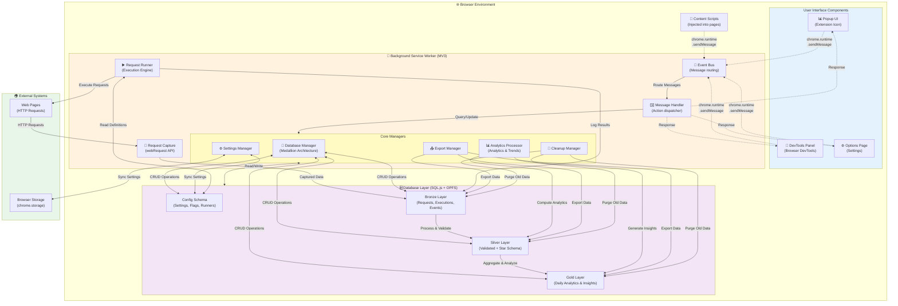
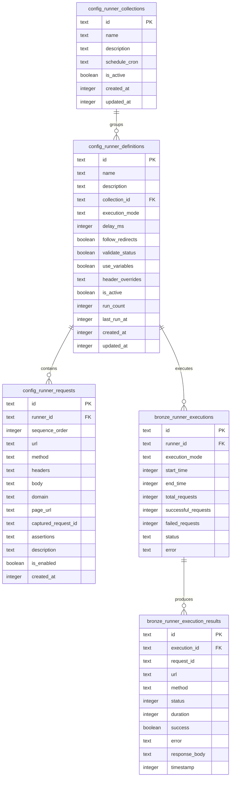
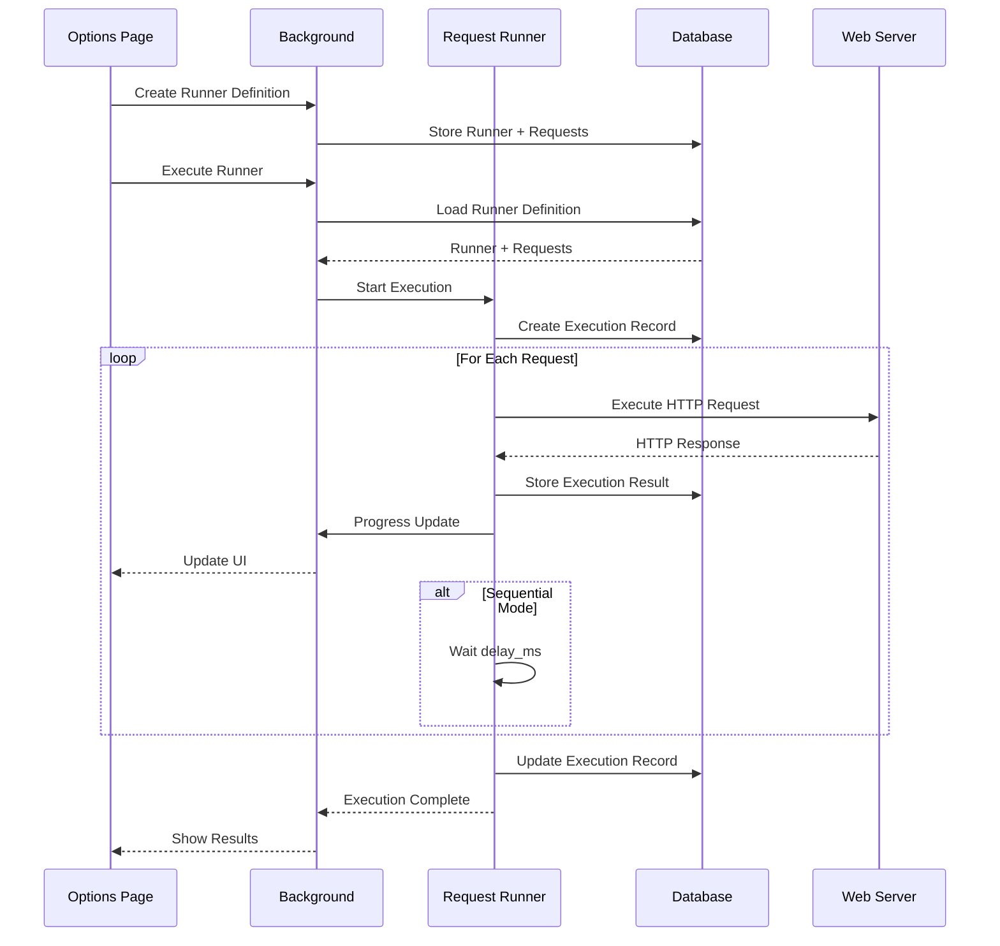

# Universal Request Analyzer - Complete Architecture Overview

## Table of Contents

1. [System Architecture](#system-architecture)
2. [Data Architecture](#data-architecture)
3. [Code Organization](#code-organization)
4. [Component Architecture](#component-architecture)
5. [Analytics & Reporting](#analytics--reporting)
6. [Development Workflow](#development-workflow)

## System Architecture

### High-Level Overview



### Communication Flow Details

1. **Request Capture Flow**

   - Browser makes HTTP request → `webRequest API` intercepts → Background captures → Bronze layer stores

2. **UI → Background Flow**

   - UI component calls `chrome.runtime.sendMessage()` → Event Bus receives → Message Handler routes → Manager processes → Database query/update → Response back to UI

3. **Settings Sync Flow**

   - Settings Manager maintains settings in both database (`config_app_settings`) and browser storage (`chrome.storage.local`) for fast access

4. **Data Processing Flow**

   - Bronze (raw) → Silver (validated + enriched) → Gold (aggregated analytics)

5. **Content Script Communication**
   - Content scripts read config from `chrome.storage.local` (set by Settings Manager) and cannot directly import background modules

## Data Architecture

### Medallion Architecture with Star Schema

```
┌──────────────────────────────────────────────────────────────┐
│ CONFIG SCHEMA - Application Configuration                    │
│ • App Settings  • Feature Flags  • User Preferences          │
│ • Performance Settings  • Storage Settings  • Export Settings│
│ • Runner Definitions  • Runner Requests  • Runner Collections│
│ • Scheduled Runs  • Runner Alerts                            │
└──────────────────────────────────────────────────────────────┘
                              ↓
┌──────────────────────────────────────────────────────────────┐
│ BRONZE SCHEMA - Raw Event Capture Data                       │
│ • Requests  • Headers  • Timings  • Events  • Sessions       │
│ • Errors  • Performance Entries  • Runner Executions         │
│ • Runner Execution Results                                   │
│ Characteristics: Immutable, Complete, Timestamped, Append-Only│
└──────────────────────────────────────────────────────────────┘
                              ↓
                        Data Processing
                  (Validation & Enrichment)
                              ↓
┌──────────────────────────────────────────────────────────────┐
│ SILVER SCHEMA - Curated Data + STAR SCHEMA                   │
│ Curated Tables:                                              │
│ • Validated Requests  • Metrics  • Domain Stats              │
│ • Resource Stats  • Tags                                     │
│                                                              │
│ Star Schema Dimensions:                                      │
│ • dim_time (Multi-timeframe)                                │
│ • dim_domain (SCD Type 2)                                   │
│ • dim_resource_type                                         │
│ • dim_status_code                                           │
│                                                              │
│ Star Schema Facts:                                           │
│ • fact_requests (Atomic metrics)                            │
│ • fact_performance_trends (Trend tracking)                   │
│ • fact_quality_metrics (Quality scores)                      │
│                                                              │
│ Characteristics: Validated, Enriched, Indexed, Analytical    │
└──────────────────────────────────────────────────────────────┘
                              ↓
                        Aggregation
                  (Daily/Weekly/Monthly)
                              ↓
┌──────────────────────────────────────────────────────────────┐
│ GOLD SCHEMA - Analytics & Insights                           │
│ • Daily Analytics  • Performance Insights                    │
│ • Domain Performance  • Optimization Opportunities           │
│ • Trends  • Anomalies                                        │
│ Characteristics: Aggregated, Historical, Actionable          │
└──────────────────────────────────────────────────────────────┘
```

### Data Flow

```
Browser Event → Bronze (Raw) → Silver (Validated + Star Schema) → Gold (Analytics)
                    ↓               ↓                                  ↓
                Immutable      Fact Tables                      Pre-aggregated
                Complete       Dimensions                       Insights
                Audit Trail    Analytics                        Trends
```

## Code Organization

### Directory Structure

```
src/
├── lib/                          # Shared Library (NEW)
│   ├── core/                     # Core Classes
│   │   └── DataManager.js        # Base data management
│   ├── ui/                       # UI Components
│   │   ├── BaseComponent.js      # Base component class
│   │   ├── ChartManager.js       # Chart management
│   │   └── NotificationManager.js # Notifications
│   ├── managers/                 # Feature Managers
│   │   └── ExportManager.js      # Export/Import
│   ├── utils/                    # Utilities
│   │   └── helpers.js            # Helper functions
│   └── index.js                  # Main entry point
│
├── background/                   # Background Service Worker
│   ├── database/                 # Database Layer
│   │   ├── medallion-schema.js   # Medallion architecture (Config + Bronze + Silver + Gold)
│   │   ├── star-schema.js        # Star schema with SCD Type 2
│   │   ├── medallion-manager.js  # Data flow orchestration
│   │   ├── config-schema-manager.js # Config management
│   │   ├── analytics-processor.js # Analytics & aggregations
│   │   ├── medallion-migration.js # Data migration
│   │   ├── db-manager-medallion.js # Main DB manager with runner CRUD
│   │   ├── sql-js-loader.js      # SQL.js initialization
│   │   └── purge-manager.js      # Data cleanup
│   ├── capture/                  # Request Capture & Runner Execution
│   │   ├── request-capture.js    # webRequest API integration
│   │   ├── request-runner.js     # Runner execution engine
│   │   ├── runner-collections.js # Runner collections manager
│   │   └── request-capture-integration.js # Medallion integration
│   ├── messaging/                # Event Bus & Message Handlers
│   │   ├── event-bus.js          # Pub/sub event system
│   │   ├── message-handler.js    # Central message router
│   │   └── popup-message-handler.js # Popup-specific handlers
│   ├── api/                      # API Services
│   ├── auth/                     # Authentication
│   ├── security/                 # Security & Encryption
│   ├── cleanup/                  # Cleanup Manager
│   ├── export/                   # Export Manager
│   ├── compat/                   # Browser Compatibility
│   │   └── browser-compat.js     # Cross-browser API wrapper
│   ├── background-medallion.js   # Main entry point (Medallion)
│   └── background.js             # Legacy entry point
│
├── popup/                        # Popup UI
│   ├── components/               # UI Components
│   └── popup.html                # Popup page
│
├── options/                      # Options Page (Settings + Dashboard + Runners)
│   ├── components/               # UI Components
│   │   ├── dashboard.js          # Dashboard with analytics
│   │   ├── runners.js            # Runner management UI
│   │   ├── analytics.js          # Analytics visualizations
│   │   ├── alerts.js             # Alert configuration
│   │   └── export-db.js          # Database export
│   ├── js/                       # JavaScript modules
│   │   └── options.js            # Main options entry point
│   ├── css/                      # Stylesheets
│   │   └── options.css           # Options page styles
│   └── options.html              # Options page
│
├── devtools/                     # DevTools Panel
│   └── devtools.html             # DevTools page
│
└── content/                      # Content Scripts
    └── content.js                # Content script
```

### Shared Library Benefits

1. **No Code Duplication**: Single source of truth
2. **Reusable Classes**: BaseComponent, ChartManager, etc.
3. **Consistent Behavior**: Same utilities everywhere
4. **Easy Maintenance**: Update once, apply everywhere
5. **Better Testing**: Test shared code once

## Component Architecture

### Base Component Pattern

All UI components extend `BaseComponent`:

```javascript
import { BaseComponent } from "@/lib/ui/BaseComponent.js";

class RequestList extends BaseComponent {
  async onInit() {
    // Initialization
  }

  setupEventListeners() {
    // Event handlers
  }

  render() {
    // Rendering logic
  }

  onDestroy() {
    // Cleanup
  }
}
```

### Manager Classes

Encapsulate complex functionality:

- **DataManager**: CRUD operations with caching
- **FilterManager**: Multi-filter support
- **SortManager**: Flexible sorting
- **PaginationManager**: Pagination logic
- **ChartManager**: Chart lifecycle
- **NotificationManager**: User feedback
- **ExportManager**: Data export/import

## Runner Architecture

### Overview

The Runner system enables automated HTTP request execution with validation, scheduling, and collections support.

### Runner Data Model



### Runner Execution Flow



### Runner Features

1. **Execution Modes**

   - **Sequential**: Execute requests one after another with configurable delays
   - **Parallel**: Execute all requests simultaneously

2. **Request Configuration**

   - Custom headers and body
   - Follow redirects option
   - Status code validation
   - Variable interpolation
   - Per-request assertions

3. **Collections**

   - Group related runners
   - Scheduled execution via cron expressions
   - Batch operations (run all in collection)

4. **Execution Tracking**

   - Real-time progress updates
   - Success/failure metrics
   - Response time tracking
   - Error logging
   - Historical execution data

5. **UI Integration**
   - Wizard-based runner creation
   - Dashboard "Run Selected" feature
   - Execution history viewer
   - Edit, duplicate, export, delete actions
   - Context menu for quick actions

## Analytics & Reporting

### Supported Timeframes

```javascript
const timeframes = [
  "1min", // 1 minute
  "5min", // 5 minutes
  "15min", // 15 minutes
  "1h", // 1 hour
  "4h", // 4 hours
  "1d", // 1 day
  "1w", // 1 week
  "1m", // 1 month
];
```

### Quality Metrics

Comprehensive site quality assessment:

- **Availability Rate**: Success percentage
- **Performance Index**: Weighted score (0-100)
- **Reliability Score**: Consistency measure
- **Security Score**: HTTPS usage
- **Cache Hit Rate**: Cache efficiency

### SCD Type 2 Tracking

Domain attributes tracked over time:

```javascript
// Version 1
{ domain: 'api.example.com', risk: 'low', valid: [t1, t2], current: false }

// Version 2 (after risk increased)
{ domain: 'api.example.com', risk: 'high', valid: [t2, null], current: true }
```

## Development Workflow

### 1. Request Capture

```javascript
// Browser makes request
→ Request Intercepted
→ Insert to Bronze Schema (raw data)
→ Queue for processing
```

### 2. Data Processing

```javascript
// Background processor
→ Read from Bronze
→ Validate & Enrich
→ Insert to Silver (curated + facts)
→ Update dimensions (SCD Type 2)
→ Queue for aggregation
```

### 3. Analytics Generation

```javascript
// Periodic processor
→ Read from Silver/Facts
→ Generate quality metrics
→ Calculate trends
→ Insert to Gold (analytics)
```

### 4. UI Display

```javascript
// User opens dashboard
→ Query Gold/Silver schemas
→ Load analytics data for selected timeframe
→ Render charts using ChartManager
→ Display quality metrics
```

## Key Features

### 1. Multi-Timeframe Analysis

View performance at any granularity:

- **Real-time**: 1min, 5min
- **Short-term**: 15min, 1h
- **Mid-term**: 4h, 1d
- **Long-term**: 1w, 1m

### 2. Historical Tracking

Complete audit trail:

- All raw requests in Bronze
- SCD Type 2 domain history
- Trend analysis in Gold

### 3. Performance Insights

- Percentile calculations (P50, P95, P99)
- Performance distribution over time
- Error rate tracking
- Response time trends

### 4. Quality Monitoring

- Availability tracking
- Performance scoring
- Reliability measurement
- Security assessment

### 5. Flexible Querying

Star schema enables:

- Drill-down by domain
- Drill-down by resource type
- Time-series analysis
- Cross-dimensional analysis

## Star Schema Details

### Dimension Tables

#### 1. Time Dimension (`dim_time`)

Multi-granularity time tracking with support for 8 timeframes.

**Supported Timeframes:**

- `1min` - 1 minute periods
- `5min` - 5 minute periods
- `15min` - 15 minute periods
- `1h` - 1 hour periods
- `4h` - 4 hour periods
- `1d` - Daily periods
- `1w` - Weekly periods
- `1m` - Monthly periods

**Key Columns:**

- `time_key` - Primary key
- `timestamp` - Unix timestamp
- `year, quarter, month, week, day, hour, minute` - Date/time components
- `period_1min ... period_1m` - Period identifiers for each timeframe

#### 2. Domain Dimension with SCD Type 2 (`dim_domain`)

Tracks domain attributes with full historical versioning using Slowly Changing Dimensions Type 2.

**SCD Type 2 Implementation:**

- Maintains complete history of attribute changes
- Each change creates a new version with `valid_from` and `valid_to` timestamps
- `is_current` flag identifies the active record
- Enables point-in-time queries

**Key Columns:**

- `domain_key` - Primary key
- `domain` - Domain name
- `is_third_party` - Third-party status
- `category` - Domain category (analytics, cdn, social, etc.)
- `risk_level` - Security risk assessment
- `valid_from, valid_to` - Validity period
- `is_current` - Current version flag
- `version` - Version number

**Example History:**

```
domain_key | domain      | risk_level | valid_from | valid_to   | is_current | version
-----------|-------------|------------|------------|------------|------------|--------
1          | api.com     | low        | 1638316800 | 1640908800 | 0          | 1
2          | api.com     | medium     | 1640908800 | NULL       | 1          | 2
```

#### 3. Resource Type Dimension (`dim_resource_type`)

Pre-populated resource type categorization:

- document, stylesheet, script, image, font
- xmlhttprequest, fetch, websocket
- media, other

#### 4. Status Code Dimension (`dim_status_code`)

HTTP status code metadata with success/error/redirect classifications.

### Fact Tables

#### 1. Request Fact Table (`fact_requests`)

Atomic request metrics linked to all dimensions.

**Key Measures:**

- Timing: duration_ms, dns_time_ms, tcp_time_ms, ssl_time_ms, wait_time_ms, download_time_ms
- Size: size_bytes, header_size_bytes, body_size_bytes
- Quality: performance_score, quality_score
- Flags: is_cached, is_compressed, has_error, is_secure

#### 2. Performance Trends Fact (`fact_performance_trends`)

Tracks metric changes with moving averages and volatility measures.

#### 3. Quality Metrics Fact (`fact_quality_metrics`)

Comprehensive quality assessment including:

- Availability rate, performance index, reliability score
- Performance distribution buckets
- Cache hit rates

## Configuration

### Application Settings

```javascript
// Via ConfigSchemaManager
await configManager.setAppSetting("theme", "dark", {
  category: "ui",
  description: "UI theme preference",
});

const theme = await configManager.getAppSetting("theme");
```

### Feature Flags

```javascript
// Gradual rollout
await configManager.setFeatureFlag("newFeature", true, {
  rolloutPercentage: 25, // 25% of users
});

const isEnabled = await configManager.getFeatureFlag("newFeature");
```

### Performance Settings

```javascript
await configManager.updatePerformanceSettings({
  enabled: true,
  samplingRate: 100,
  captureNavigationTiming: true,
});
```

## Best Practices

### 1. Data Layer

✅ **Do:**

- Write to Bronze first
- Let system process to Silver/Gold
- Use Config schema for settings
- Query appropriate layer (Silver for UI, Gold for dashboards)

❌ **Don't:**

- Write directly to Silver/Gold
- Skip Bronze layer
- Store config in Bronze/Silver/Gold

### 2. Components

✅ **Do:**

- Extend BaseComponent
- Use shared utilities from /lib
- Implement proper cleanup
- Emit events for communication

❌ **Don't:**

- Duplicate code between popup/options
- Create new utility functions
- Skip lifecycle methods

### 3. Analytics

✅ **Do:**

- Choose appropriate timeframe
- Use percentiles for performance analysis
- Cache aggregated data
- Index fact tables properly

❌ **Don't:**

- Query Bronze for analytics
- Recalculate aggregates on every query
- Skip dimension lookups

## Performance Optimization

### 1. Database

- Indexes on all foreign keys
- Compound indexes on frequently queried columns
- Periodic VACUUM
- Archive old Bronze data

### 2. Caching

- Cache dimension lookups
- Cache configuration
- Pre-calculate aggregates
- Store aggregates in Gold

### 3. Query Optimization

- Use star schema for complex queries
- Leverage pre-aggregated analytics data
- Filter by dimensions
- Limit result sets with pagination

## Future Enhancements

1. **Machine Learning Layer**

   - Anomaly detection
   - Performance predictions
   - Optimization recommendations

2. **Real-time Streaming**

   - Live performance updates
   - WebSocket support
   - Real-time dashboards

3. **Advanced Analytics**

   - Correlation analysis
   - Regression analysis
   - Forecasting

4. **Data Export**

   - External BI tools integration
   - API for analytics
   - Scheduled exports

5. **Partitioning**
   - Time-based partitions
   - Archive old data
   - Improve query performance
