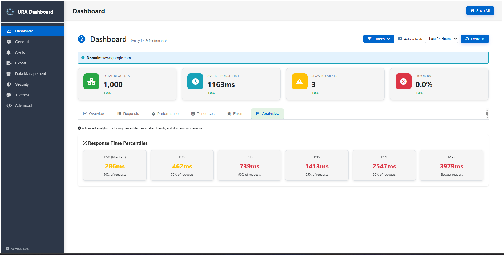
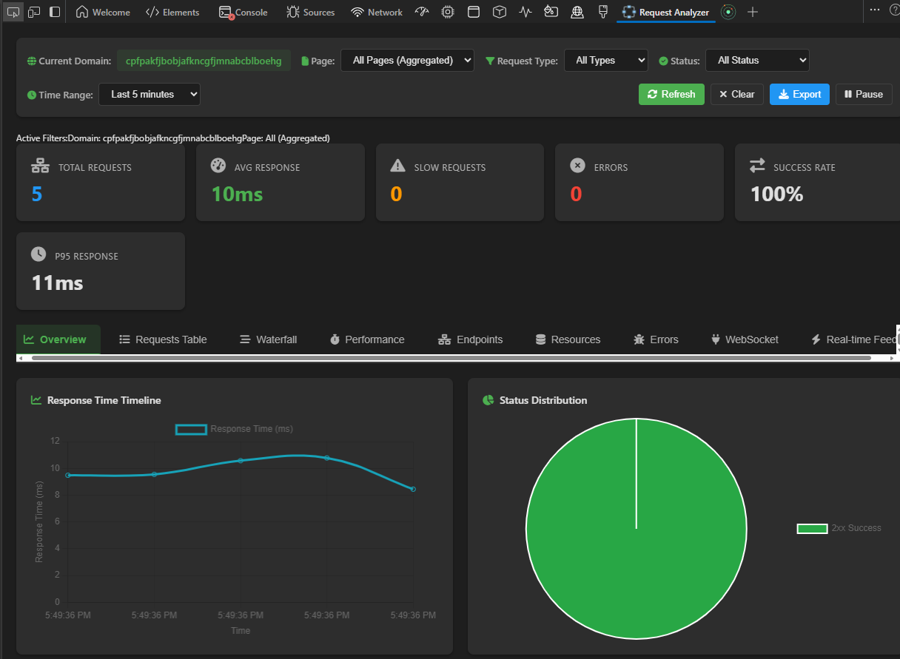
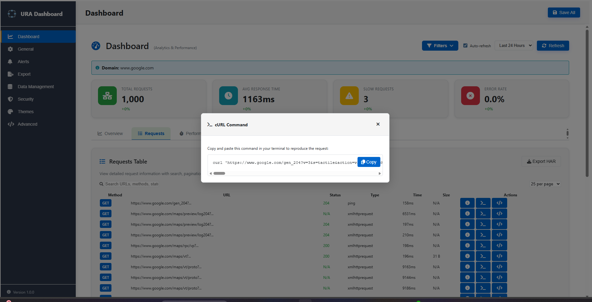

<!-- Hero Section -->

  

    <h1>Universal Request Analyzer</h1>
    
DevTools network inspection with persistent SQLite storage, historical analytics, and performance tracking. Never lose your debugging data again.

    
    

      <a href="https://github.com/ModernaCyber/Universal-Request-Analyzer/raw/main/release/ura.zip" class="btn-download" download>
        ⬇️
        Download Extension
      </a>
      <a href="https://github.com/ModernaCyber/Universal-Request-Analyzer" class="btn-github">
        ⭐
        Star on GitHub
      </a>
    

  

  
  

    

      
      

        <h3>📊 Analytics Dashboard</h3>
        
Track API performance over time

      

    

    
    

      
      

        <h3>⚡ DevTools Panel</h3>
        
Real-time request monitoring

      

    

    
    

      
      

        <h3>🔄 Export Actions</h3>
        
Copy as cURL or Fetch code

      

    

  

<!-- Features Section -->

  

    <h2>Everything you need for network debugging</h2>
    
Powerful features built for developers who debug APIs daily

  

  
  

    

      💾
      <h3>Persistent SQLite Database</h3>
      
All requests stored locally. Data survives browser restarts. Query with raw SQL or use the dashboard.

    

    
    

      ⚡
      <h3>Real-Time DevTools Panel</h3>
      
Integrated Chrome DevTools panel with filtering, waterfall visualization, and timing breakdown.

    

    
    

      📊
      <h3>Performance Analytics</h3>
      
Plot individual request times at actual timestamps. Spot latency spikes and analyze patterns.

    

    
    

      🔄
      <h3>Export as cURL/Fetch</h3>
      
Copy requests as cURL commands or JavaScript Fetch. Variable substitution for API tokens.

    

    
    

      🗄️
      <h3>Medallion Architecture</h3>
      
Bronze → Silver → Gold data layers for efficient analytics. Direct SQL query support.

    

    
    

      🚨
      <h3>Error Tracking</h3>
      
Automatic 4xx/5xx detection. Analyze error patterns and set up custom alerts.

    

    
    

      📤
      <h3>Multiple Export Formats</h3>
      
Export as HAR, JSON, or CSV. Share data with your team or import into other tools.

    

    
    

      🎨
      <h3>Light & Dark Themes</h3>
      
Fully customizable with CSS variables. Respects your system preferences.

    

  

<!-- Use Cases -->

  

    <h2>Built for real debugging scenarios</h2>
  

  
  

    

      🐛
      Debug intermittent API issues that are hard to reproduce
    

    
    

      ⚡
      Track performance regressions across deployments
    

    
    

      🔍
      Analyze third-party service impact on your app
    

    
    

      📊
      Monitor production API behavior and patterns
    

    
    

      🧪
      Compare request behavior across sessions
    

  

<!-- Tech Stack -->

  

    <h3>Built with modern web technologies</h3>
    

      Chrome Manifest V3
      SQL.js (SQLite)
      Chart.js
      Vanilla JavaScript
      Webpack
      Jest Testing
      Cross-Browser
    

  

<!-- Quick Start -->

  

    <h3>🚀 Get started in 30 seconds</h3>
    <ol>
      <li>Download <code>ura.zip</code> from the button above</li>
      <li>Extract the archive to a folder</li>
      <li>Open Chrome → <code>chrome://extensions/</code></li>
      <li>Enable <strong>"Developer mode"</strong> (top right toggle)</li>
      <li>Click <strong>"Load unpacked"</strong> → select the extracted folder</li>
      <li>Browse any website → requests are captured automatically ✨</li>
    </ol>
    
<strong>Access the extension:</strong>

    <ul style="list-style: none; padding-left: 0;">
      <li><strong>DevTools Panel:</strong> Press F12 → click "URA" tab</li>
      <li><strong>Dashboard:</strong> Click extension icon → "Dashboard"</li>
      <li><strong>Popup:</strong> Click extension icon for quick stats</li>
    </ul>
  

<!-- Browser Support -->

  

    <h2>Cross-browser compatibility</h2>
  

  
  <table class="browser-table">
    <thead>
      <tr>
        <th>Browser</th>
        <th>Version</th>
        <th>Status</th>
      </tr>
    </thead>
    <tbody>
      <tr>
        <td>Chrome</td>
        <td>88+</td>
        <td>✅ Fully Supported</td>
      </tr>
      <tr>
        <td>Edge</td>
        <td>88+</td>
        <td>✅ Fully Supported</td>
      </tr>
      <tr>
        <td>Firefox</td>
        <td>109+</td>
        <td>✅ Fully Supported</td>
      </tr>
    </tbody>
  </table>

<!-- Documentation -->

  

    <h2>Documentation</h2>
  

  
  

    <a href="USER_GUIDE.html" class="doc-card">
      <h4>📖 User Guide</h4>
      
Complete feature walkthrough

    </a>
    
    <a href="ARCHITECTURE.html" class="doc-card">
      <h4>🏗️ Architecture</h4>
      
System design & data flow

    </a>
    
    <a href="DEVELOPMENT.html" class="doc-card">
      <h4>💻 Development</h4>
      
Build, test, contribute

    </a>
    
    <a href="https://github.com/ModernaCyber/Universal-Request-Analyzer/blob/main/CONTRIBUTING.md" class="doc-card">
      <h4>🤝 Contributing</h4>
      
Contribution guidelines

    </a>
  

<!-- Footer CTA -->

  <h2>Ready to upgrade your debugging workflow?</h2>
  
Download the extension and never lose network data again

  <a href="https://github.com/ModernaCyber/Universal-Request-Analyzer/raw/main/release/ura.zip" class="btn-download" download>
    ⬇️
    Download Now (v1.0.0)
  </a>

---

  MIT License · Open Source · Built for Developers

